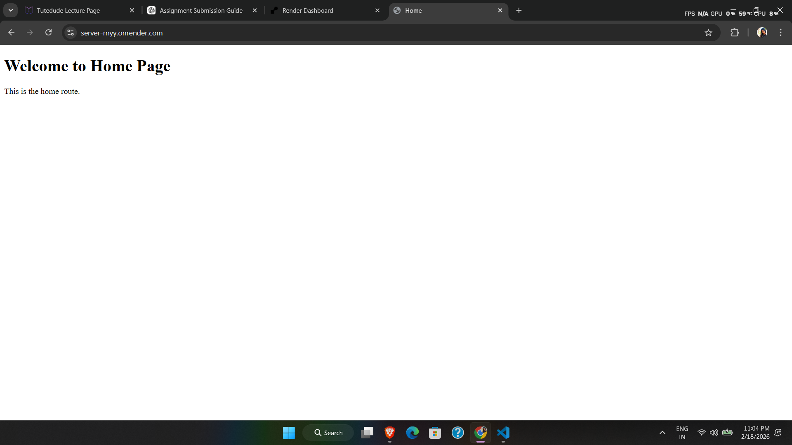
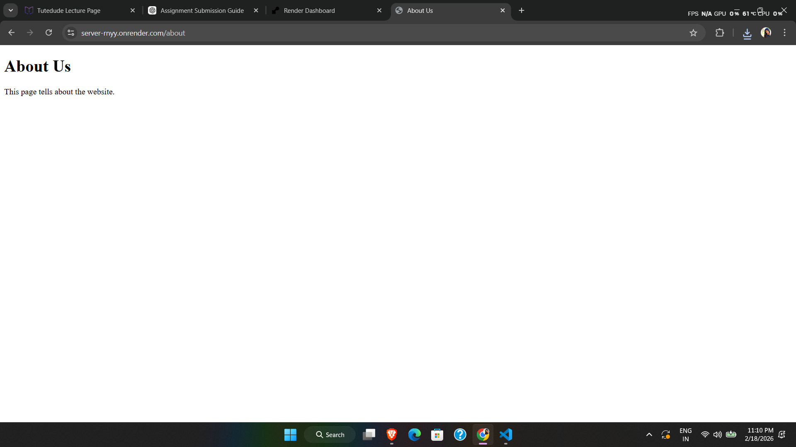

# Web Server Project

## Project Description
This is a basic web server built using Node.js and Express.js.  
It serves multiple HTML pages with proper routing and static file handling.

## How the Server Works

This web server is built using Node.js and Express.js.

- The server uses Express to handle HTTP requests.
- Static files like CSS are served using Express middleware (`express.static`).
- The server defines routes for different pages:
  - `/` → Serves the Home page
  - `/about` → Serves the About page
  - `/contact` → Serves the Contact page
- Each route sends an HTML file using `res.sendFile()`.
- If a user visits a route that does not exist, the server returns a custom 404 error page using middleware.
- The server uses a dynamic PORT (`process.env.PORT`) so it works both locally and on Render deployment.

## Deployed Project Link
https://server-rnyy.onrender.com

## Tech Stack
- Node.js
- Express.js
- HTML
- CSS

## How to Run Locally

1. Clone the repository
2. Run `npm install`
3. Run `node server.js`
4. Open http://localhost:3000 in your browser

## Screenshots

### Home Page (/)

### About Page (/about)

### Contact Page (/contact)

### 404 Error Page (Invalid Route)

